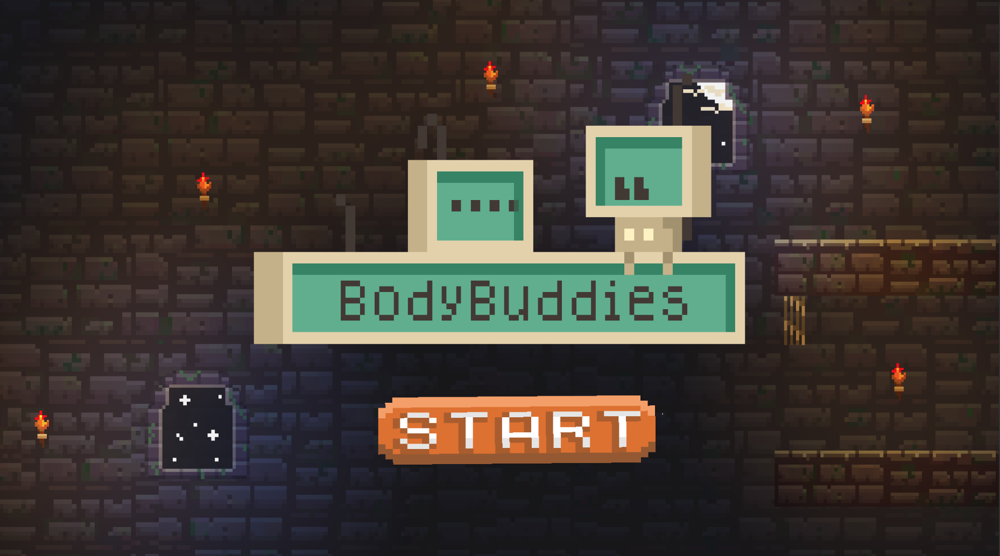

# BodyBuddies

## 🎮 What is BodyBuddies?

We made BodyBuddies for <a href="https://www.ieeehacettepe.org/puragamejam?ref=hackathonturkiye.com">Pura Game Jam</a> event. 
 

In this game we want to use death as a game mechanic. To complete level you should die intentionally and use your player's body to overcome the obstacles.

To Play The Game: <a href="https://alkanakisu.itch.io/bodybuddies">itch.io page</a>
 

## 👨‍💻👨‍🎨Who made this?
<!-- Alkan -->
<a href="https://github.com/AlkanAkisu" >

<a>

🖥 Programming: 

<a href="https://github.com/AlkanAkisu">
Alkan Akısu 
<a>

<!-- Erman -->
<a href="https://github.com/JellyCube3D">

<a>

🎨 Visual Arts and Audio: 

<a href="https://github.com/JellyCube3D">
Erman Arslan 
<a>
